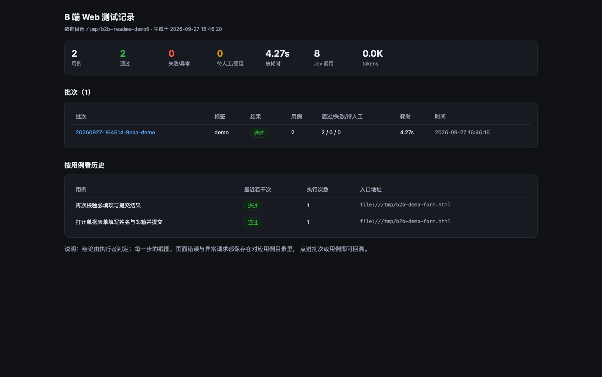
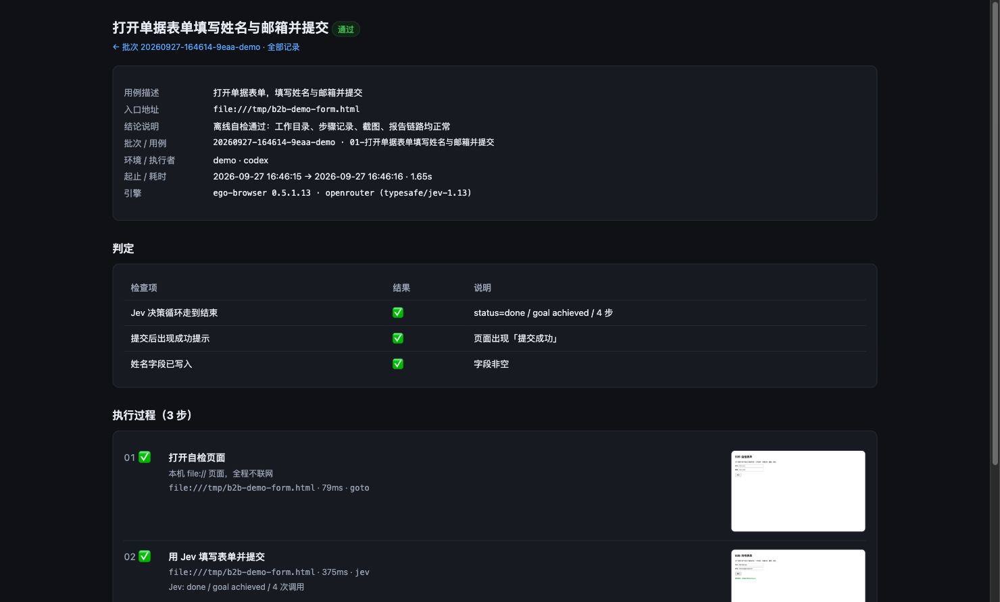

# b2b-web-test

**中文** · [English](README.en.md)

用 **ego-browser**（浏览器执行）与 **Jev**（每步元素决策）跑 B 端 Web 测试。
输入「入口地址 + 自然语言用例描述」，由 AI 逐条执行；每个用例在独立工作目录留下
过程截图、步骤时间线与结论，并生成可离线打开的可视化看板。

**MIT** · macOS · 运行链路零外部依赖（不需要 jq / node / python）



---

## 背景

企业内部系统、管理后台、SaaS 控制台的回归测试，长期卡在两条路都不好走：

| 现有方案 | 优势 | 代价 |
|---|---|---|
| 传统脚本（Selenium / Playwright） | 单次运行边际成本≈0，结果确定 | 选择器随前端改版断裂；维护成本全压在人身上；用例与实现强耦合 |
| 纯大模型 Agent 操作页面 | 灵活，能处理没见过的界面 | 每步都要把截图与 DOM 交给大模型，输入量大、延迟秒级；长流程成本迅速累积 |
| **本方案** | 逐元素决策交给小模型；内容理解与判断交给 AI；记录交给工具 | 需要 macOS + ego lite + 一个 Jev 后端密钥 |

核心判断是：**"点哪个元素"和"看懂这一页"是两种不同的工作**。
前者重复、结构化，适合用便宜的小模型逐步决策；后者需要理解与判断，才值得动用大模型。
把两者拆开，成本与稳定性可以同时改善。

## 它是什么

三层分工，各司其职：

| 层 | 组件 | 职责 |
|---|---|---|
| 执行层 | ego-browser（由 [ego lite](https://lite.ego.app/) 提供） | 打开页面、语义快照、点击 / 填表 / 选择器、截图、页面内请求、会话复用 |
| 决策层 | Jev（TypeSafe System One） | 每步：快照 → 给可交互元素编号 → 一次调用选出「操作 + 目标」。**不读内容、不写文本、不看截图** |
| 编排层 | 本仓库 `scripts/lib/` | 工作目录与记录、判定与证据、报告与看板、会话复用、成本记账 |

一条用例的执行循环：

```
建工作目录 → 打开入口地址 → [ Jev 决策 → ego 执行 → 记录截图 ] × N
          → AI 用页面事实核对 → 写下结论 → 生成报告与看板
```

典型部署组合：**DeepSeek v4.1 Flash 负责编排**（读页面、判断、写脚本），
**Jev 负责逐步决策**（点哪个元素）。这条组合下，一次测试（一条 3 步用例）
的成本约 **¥0.2**，详见下方实测数据。

## 实测数据

以下数字来自本仓库在真实环境（macOS + ego lite + 真实 Jev 后端）的运行记录，
非估算值；离线部分可用 `b2b-test selfcheck` 复现。

**真实用例**（公开表单页，填写两个字段并核对，3 步）

| 指标 | 实测值 |
|---|---|
| 用例总耗时（含打开页面） | **6.60 s** |
| 步骤数 / 过程截图 | 3 / 3 |
| 决策循环 | 3 步，共 3.76 s |
| 单次决策延迟 | 0.77 – 1.85 s（平均 1.13 s） |
| 语义快照生成 | 18 – 40 ms |
| DOM 补全扫描（发现无角色可点击元素） | 2 – 5 ms |
| 动作执行（填写 / 点击） | 122 – 139 ms |
| 结论核对（读取字段值） | 8 ms |
| token 消耗 | 输入 **9,016** / 输出 **1,963**（3 次调用，约 3.0K 输入/次） |
| 服务模型 | typesafe/jev-1.13-20260917 |
| 结论 | pass（两个字段值与预期完全一致） |

> token 消耗与页面候选元素数量相关。本次页面元素极少（约 3.0K 输入/次）；
> 上游在 20–120 个候选元素时测得约 11K 输入/步。记录里会汇总每条用例的实际用量。

**一次测试的成本**（参考组合：DeepSeek v4.1 Flash 编排 + Jev 逐步决策）

| 指标 | 值 |
|---|---|
| 一次测试（一条 3 步用例）成本 | **约 ¥0.2** |
| 对应 Jev token | 输入 9,016 / 输出 1,963 |
| 编排模型 | DeepSeek v4.1 Flash |
| 决策模型 | Jev（TypeSafe System One） |

> 成本随流程长度、页面候选元素数量与所选后端定价变化；¥0.2 是上述组合下一次测试的参考值。
> 记录里逐条汇总 Jev 的调用次数与 token（`result.json` 的 `jev` 字段），便于按自己的价格换算。
> 说明区分：**token 与延迟为工具自身记录的测量值**，**¥0.2 为该组合下的参考成本**。

**离线自检**（内置 mock 决策器，不联网、不消耗 token）

| 指标 | 实测值 |
|---|---|
| 用例总耗时 | 1.9 – 3.6 s |
| 步骤数 / 过程截图 | 3 / 3 |
| 判定项 | 3 项全部通过 |
| token 消耗 | **0** |
| 覆盖链路 | 工作目录 → 记录 → 截图 → 结论 → 报告 → 看板 |

**回归批次**（同批次 2 条用例）

| 指标 | 实测值 |
|---|---|
| 批次总耗时 | 4.27 s |
| 用例数 / 通过 | 2 / 2 |
| 产物 | 每条用例 3 张过程截图 + 时间线 + 结论 + 单页报告 |

**自带测试**

| 指标 | 实测值 |
|---|---|
| 单元与集成测试 | **39 项全部通过**（含可移植性守卫） |
| 运行方式 | `b2b-test test`（纯逻辑，不开浏览器、不联网） |

## 安装

**方式一：交给 AI（推荐）**

> 帮我安装并配置 b2b-web-test：仓库 `https://github.com/Buex007/b2b-web-test`，
> 执行 `init` 与 `selfcheck`，缺什么你自己处理，最后把结果给我看。

**方式二：自己安装**

```sh
git clone https://github.com/Buex007/b2b-web-test.git ~/.codex/skills/b2b-web-test
sh ~/.codex/skills/b2b-web-test/install.sh
```

`install.sh` 会把技能链接到本机已有的技能目录（Codex / Claude / 共享目录），随后执行初始化。
可先预览将要做的事：`sh install.sh --dry-run`。

## 使用前提

### 只有两件事必须人工完成

其余所有环节（安装、配置、建工作目录、执行、出报告）都可以交给 AI。

| 必须你本人做 | 为什么 AI 代替不了 |
|---|---|
| **1. 下载并打开 ego lite，走完首次引导** | 首次引导是图形界面操作，脚本无法代劳；`ego-browser` 命令也由它注册 |
| **2. 获取一个 Jev 后端密钥** | 注册账号需要邮箱、可能需要绑卡；且密钥不应经聊天窗口转手 |

**1. ego lite（一次性，约 2 分钟）**

1. 打开 <https://lite.ego.app/>，下载 macOS 版
2. 安装后**把它打开**，按引导走完（询问是否导入浏览器数据时可跳过）
3. 引导过程中会把 `ego-browser` 命令注册到 `~/.local/bin`
4. 若被 Gatekeeper 拦下：**系统设置 → 隐私与安全性 → 仍要打开**

**2. Jev 密钥**（三选一）

| 选 | 地址 | 操作 |
|---|---|---|
| ① OpenRouter（推荐） | <https://openrouter.ai/settings/keys> | 注册 → **Create Key** → 复制形如 `sk-or-v1-xxxx` 的串 |
| ② TypeSafe | <https://typesafe.ai/> | 注册 → 在控制台复制 API Key |
| ③ Vercel AI Gateway | <https://vercel.com/dashboard> | 打开 AI Gateway → 生成 API Key |

> ⚠️ **不要把密钥粘贴进聊天窗口。** 让 AI 执行 `b2b-test key`，你在它打开的终端里直接粘贴
> （输入不回显）；或由你自己在终端执行。该命令会自动判断后端、写入 `0600` 权限的配置，
> 并立即联网验证密钥是否被后端接受。

## 操作

### 与 AI 交互（推荐）

把下面这段复制给任意能执行命令的智能体（Codex / Claude Code / Cursor / 自研 agent 均可）：

> 用 b2b-web-test 帮我跑一条 B 端用例。
> 入口地址：`https://你的系统地址`
> 用例描述：`你想验证什么，例如"登录后新建订单，确认列表出现该订单"`
>
> 配置和执行你自己做，不要让我手动敲命令；只有必须我本人操作的地方
> （ego lite 引导、Jev 密钥、浏览器里的登录 / MFA）再来找我。

AI 会依次执行：`install.sh` → `init` → `doctor` → `new` → 编写 `plan.mjs` → `exec` → `report`。
你只会在这三处被叫到：**ego lite 引导**、**Jev 密钥**、**登录 / 短信 / MFA**。

### 手动操作（AI 不在身边时）

```sh
b2b-test init                                        # 初始化：检查 ego lite、写配置、跑离线自检
b2b-test key                                         # 配置 Jev 密钥（交互式，粘贴不回显，立即验证）
b2b-test doctor                                      # 环境体检
b2b-test new "用例描述" --url https://... --label v2.3.1   # 执行前先建工作目录
b2b-test exec "<用例目录>"                            # 执行并写入记录
b2b-test report --open                               # 打开可视化看板
```

| 命令 | 作用 |
|---|---|
| `b2b-test key check` | 查看密钥来源、后端与有效性（不消耗生成额度） |
| `b2b-test exec "<目录>" --junit` | 额外输出 `junit.xml`，供 CI 使用 |
| `b2b-test exec "<目录>" --mock` | 使用内置 mock 决策器执行（不联网，用于自检） |
| `b2b-test ls [--limit N]` | 列出批次与用例结论 |
| `b2b-test session list` / `close <环境>` | 查看 / 关闭复用的登录态会话 |
| `b2b-test prune --keep 10` | 按批次清理历史记录 |
| `b2b-test selfcheck` | 离线全链路自检 |
| `b2b-test test` | 代码自测（纯逻辑） |

`new` 的常用选项：

| 选项 | 说明 |
|---|---|
| `--url <地址>` | 入口地址（必填） |
| `--label <标签>` | 批次标签，如 `v2.3.1`、`冒烟` |
| `--continue` | 挂到最近一个批次（用于批量回归） |
| `--env <环境名>` | 环境名，计入记录 |
| `--out <目录>` | 记录写入指定目录（可跟随被测项目） |
| `--shots step\|fail\|off` | 过程截图策略，默认每步一张 |

### 结论与退出码

结论取值 `pass` / `fail` / `need-human` / `blocked` / `error` / `running`，
对应退出码 `0` / `1` / `2` / `3` / `1` / `4`，可直接用于 CI 判定。

## 记录

默认写入 `~/.local/share/b2b-web-test/`（位于仓库之外，避免客户数据进入版本库）：

```
batches/<批次号>/cases/<序号-用例名>/
  case.md        入口地址与用例描述原文
  plan.mjs       执行脚本
  steps.jsonl    步骤时间线（边执行边追加）
  shots/         过程截图
  result.json    结论（机器可读）
  report.md      纯文本报告
  report.html    单文件可视化
reports/index.html   全局看板（批次总览 + 同一用例历次结果）
```



## 能力边界

- Jev **不读内容、不写自由文本、不看截图**：这三类交回 AI，属于分工而非缺陷
- **不自动化登录 / MFA / 验证码**：交回人工，之后复用登录态
- **顺序执行**：一条用例一个会话，不并行、不做压测
- **Canvas / 复杂可视化页面**：语义快照中没有可用元素时会报 `blocked`，需单独编写坐标兜底
- 破坏性操作（删除 / 支付 / 权限变更）默认被拦截并交回人工

## 可移植性

- **任意 Mac 用户**：不硬编码家目录、技能路径或 ego lite 版本号，所有路径在运行时解析
- **任意智能体**：能力契约是「能执行 shell 命令 + 能把脚本交给 `ego-browser nodejs`」；
  人也可以使用同一套 CLI
- **零外部依赖**：启动器为 POSIX sh，不需要 `jq` / `node` / `python`
- 自测中包含守卫：扫描硬编码路径、写死版本号、GNU 专有的 sed / grep 扩展

## 文档

[SKILL.md](SKILL.md)（AI 入口）·
[初始化与排错](references/initialization.md)·
[可移植性](references/portability.md)·
[记录协议](references/workdir-protocol.md)·
[可视化](references/visualization.md)·
[B 端常见场景](references/b2b-patterns.md)·
[融合层与升级](references/jev-fusion.md)

## 许可

**MIT** —— 见 [LICENSE](LICENSE)。

本仓库包含第三方代码：`scripts/vendored/jev-loop.mjs` 逐字节复制自 ego-jev（MIT），
未作任何改动。按上游声明：

> MIT. Policy, snapshot, and question text are derived from jev-ultrafast (MIT, Browser Use).

完整归属与维护约定见 [THIRD-PARTY-NOTICES.md](THIRD-PARTY-NOTICES.md)。
